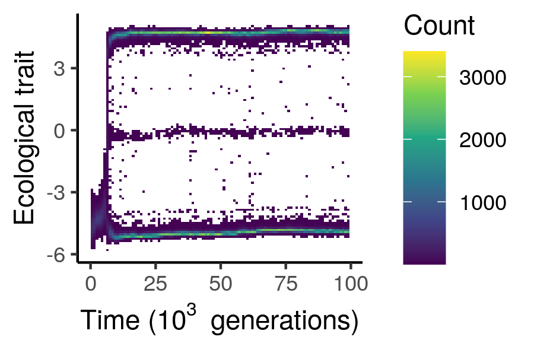
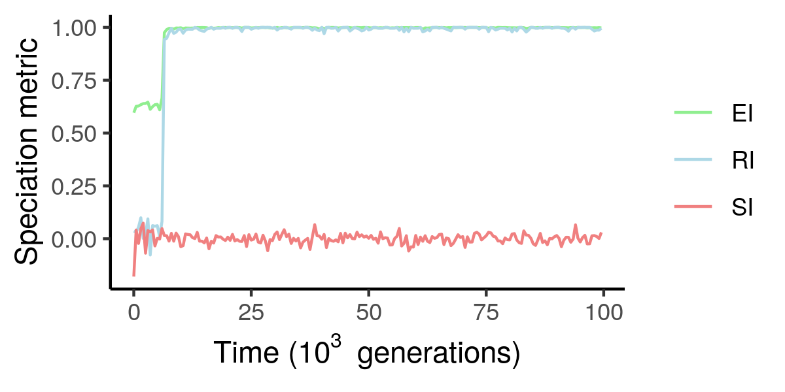
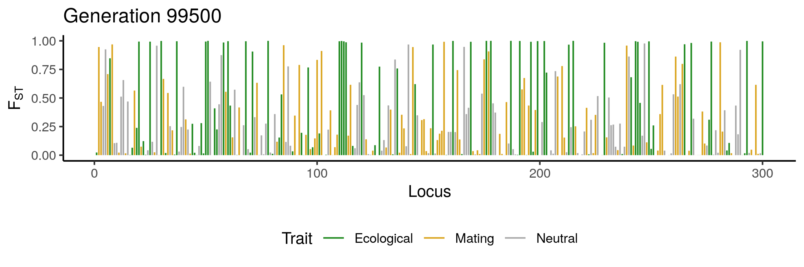
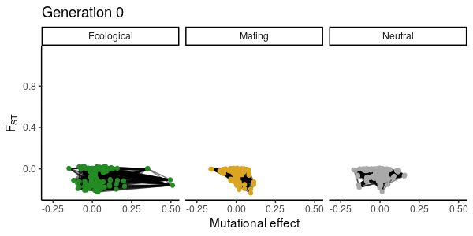

# speciome

Individual-based simulation of adaptive speciation with explicit genomes and genotype-phenotype map.

## Snapshots

These are some possible outcomes of the model (produced in R):

 
 

## Model description

This is an individual-based simulation of a population of sexual organisms evolving in a system with two habitats linked by dispersal. Individuals can utilize two resources in their environment, and the abundances of these resources between the two habitats can be tuned. Through genetic evolution, the organisms can adapt to utilize different resources, and under some circumstances this can lead to adaptive speciation, where two reproductively isolated species emerge from a single one. 

There are three quantitative traits in the model: an ecological one, a mating one and a neutral one. The ecological trait determines utilization efficiency of the two resources, which can be subject to a trade-off such that no individual can be efficient at utilizing both resources. The mating trait controls the sexual preference of females for more ecologically similar (when positive) or dissimilar (when negative) males. The target of mate choice is the ecological trait, which makes it a magic trait. The neutral trait is here for control. 

Each individual has a diploid genome with a discrete number of loci, which come in either of two alleles: 0 and 1. There are loci coding for each of the three traits, and so the evolution of these traits depends on evolution at the genomic level under mutation, selection, drift, migration and recombination.

This model implements different kinds of genotype-phenotype mapping scenarios (i.e. how the loci code control the traits of the individuals), encompassing the main sources of genetic variation from quantitative genetics: additive, dominance, epistatic and environmental effects. To accomodate epistatic effects in particular, each trait has its own gene regulatory network, which can be built by the simulation using a preferential attachment algorithm, or specified externally, together with the additive effects, dominance coefficients, encoded traits and locations of the loci. 

The simulation can record a whole lot of variables, from the degree of reproductive isolation between the species to the genetic differentiation at each gene in the genome, and more. It can be used to test whether different genetic architectures equally lead to speciation, or to explore the traces that are left in the genome as speciation happen, in order to maybe help empiricists make better sense of the patterns found in nature.

## About

This program was written in C++14 in QtCreator 4.9.2 (Qt 5.12.4) on Ubuntu 18.04 LTS, but should run on other platforms too.

This is a copy of the ExplicitGenomeSpeciation program, version 1.0. See https://github.com/rscherrer/ExplicitGenomeSpeciation for more details.

## Status

Branch|[](https://travis-ci.org)|[](https://www.codecov.io)
---|---|---
master|[](https://travis-ci.org/rscherrer/speciome)|[](https://codecov.io/github/rscherrer/speciome/branch/master)
develop|[](https://travis-ci.org/rscherrer/speciome)|[](https://codecov.io/github/rscherrer/speciome/branch/develop)

## Build

All the source and header files needed are in the `src` folder. The main function is in the `main.cpp` file.

## Usage

The program has a command-line interface (CLI). Running it on its own will run a simulation with default parameters (see below). Non-default parameters can be specified by providing a parameter file, i.e. a text file containing on each row the name of a parameter and the value it should take (e.g. `mutation 0.0001`). It should look something like:

```
./speciome parameters.txt
```

## Parameters

Non-default parameters are supplied in a parameter file. The parameter file must contain on each line, the name of one parameter followed by a blank (e.g. space or tab) and the value(s) that this parameter must take. Parameter names must match those in the table. Parameters that are not in the parameter file will take default values. Parameters that take multiple values must be supplied as such, with values separated by blanks (e.g. `nvertices 30 30 30`).

We describe the different parameters (and their default value).

Ecological parameters:

* `rdynamics` (default 1) is the type of resource dynamics (0 for *logistic dynamics*, which assume a biotic resource with an intrinsic growth and a carrying capacity, or 1 for *chemostat dynamics* with and inflow and outflow of some abiotic resource)
* `replenish` (2375) and `capacity` (1) are the growth rate and carrying capacity, respectively, of the resources assuming logistic dynamics (`rdynamics 0`)
* `inflow` (400) and `outflow` (100) are the absolute inflow and relative outflow rates of the resources, respectively, assuming chemostat dynamics (`rdynamics 1`)
* `hsymmetry` (0) is the degree of homogeneity in resource distribution between the two habitats. It basically is a scaling factor to make the realized `replenish` (if logistic resource dynamics) or `inflow` (if chemostat resource dynamics) differ between the habitats, ranging between 0 and 1
* `ecosel` (1.8) is the ecological trade-off in utilization between the two resources. It must be zero or positive, and the higher it is, the less efficient is utilizing both resources instead of specializing on a single one
* `ecoscale` (1) is a scaling parameter for the phenotypic distance between the two ecological niches along the ecological trait axis. A value of 1 means that the peaks of the two niches in utilization efficiency are at -1 and +1, respectively. This parameter also scales the widths of the resource utilization curves accordingly
* `demesizes` (100, 0) are the number of individuals initialized in both habitats, respectively
* `dispersal` (0.01) is the proportion of individuals sampled to switch habitats every generation
* `birth` (1) is the base birth rate per female, independent of fitness
* `survival` (0.8) is the probability of survival of adult individuals from one generation to the next (it takes one generation for newborns to become adults)
* `sexsel` (10) is the sexual selection coefficient, a positive number mediating the general degree of choosiness of females towards males during the mating season
* `matingcost` (0.01) is the fitness cost of choosy females (that run the risk of remaining unmated)
* `ntrials` (100) is the number of mating trials to perform to measure the degree of reproductive isolation between the species

Genetic parameters:

* `nvertices` (30, 30, 30) and `nedges` (30, 0, 0) are the numbers of loci and edges, respectively, in each of the three gene networks (one for each trait in the following order: ecological, mating and neutral). `nvertices` must be at least 2 for each trait, and `nedges` cannot be higher than n (n - 1) / 2 (complete graph), if n is the number of vertice for a given trait. In practice, the preferential attachment algorithm may fail to attach all the requested edges of the network if nedges is close to the maximum possible number of edges. In this case the program will return an error. The number of edges should be at least n-1, which ensures that the network is connected (all the nodes are attached).
* `nchrom` (3) is the number of equally sized chromosomes
* `mutation` (0.001) is the mutation rate per locus
* `recombination` (3) is the recombination rate and corresponds more or less to the average number of crossovers during one recombination event. It is actually the rate of an exponential distribution describing the distance between successive crossover points
* `allfreq` (0.2) is the initial frequency of the 1-allele in the population
* `scaleA` (1, 1, 1), `scaleD` (0, 0, 0), `scaleI` (0, 0, 0) and `scaleE` (0, 0, 0) are scaling factors for each source of phenotypic variation in the quantitative genetics framework, i.e. additive, dominance, epistatic and environmental effects, respectively, for each of the three traits
* `skews` (1, 1, 1) are the skewnesses of each of the three gene networks
* `effectshape` (2) and `effectscale` (1) are the parameters of the distribution of additive effect sizes across loci. If the resulting distribution has variance 0, all the loci are assigned effect size 1
* `interactionshape` (5) and `interactionscale` (1) are the parameters of the distribution of epistatic interaction weights across edges. If the resulting distribution has variance 0, all the edges are assigned interaction weight 1 
* `dominancevar` (1) is the standard deviation of the distribution of dominance coefficients across loci. If 0, all the loci are assigned dominance coefficient 1

General simulation parameters:

* `tburnin` (0) is the duration of the burn-in period, in generations
* `tend` (10) is the number of generations to simulate (after burn-in)
* `tsave` (10) is the frequency at which to record the data
* `tcomplete` (1000000) is the time at which to force complete reproductive isolation between the two ecotypes (can mimic e.g. genomic incompatibilities between the two species, or the evolution of very good species recognition abilities)
* `talkative` (1) is either 0 or 1 and sets whether the simulation should print status information to the prompt
* `choosewhattosave` (0) is either 0 or 1 and sets whether the variables to save are specified in a separate file, the order file `whattosave.txt` (see below). If 0 all of the output variables are saved every `tsave` generations except for whole genomes
* `datsave` (1) sets whether to save the recorded variables to files
* `burninsave` (0) sets whether to save data during the burn-in phase too (time points belonging to the burn-in are negative)
* `gensave` (0) is either 0 or 1 and sets whether whole genomes should be saved every `tfreeze` generations (see below)
* `archsave` (0) is either 0 or 1 and sets whether the genetic architecture should be saved into file `architecture.txt` (see below)
* `archload` (0) sets whether the genetic architecture of the simulation should be loaded from file `architecture.txt` instead of generated anew
* `parsave` (1) sets whether to save the parameters of the simulation run to file, including the random seed, into a parameter-log file `paramlog.txt`
* `logsave` (0) sets whether the output to prompt should be redirected to a log file `log.txt`
* `seed` is the seed of the random number generator, and it is by default randomly generated based on the clock

Note that it is a good idea to set `parsave 1` and `logsave 1`, to make sure the full range of parameter values can be retrieved or the simulation progress can be monitored. Some analysis functions from the R package [speciomer](https://github.com/rscherrer/speciomer) actually expect the parameter-log file "paramlog.txt" to be present.

## Genetic architecture

The genetic architecture refers to the constant features of the genetic part of the program, that is, features that do not change through time and cannot evolve. These include the number of chromosomes, the numbers of loci and edges for each trait, the trait each locus codes for as well as its location in the genome, its additive effect size and its dominance coefficient, and finally the topology and distribution of interaction weights across edges within each of the three gene networks (one for each trait, the networks are independent).

A genetic architecture can either be generated anew at the beginning of a simulation by randomly sampling the aforementioned features and building networks with a random preferential attachment algorithm, or it can be supplied to the program in an architecture file `architecture.txt`. To load the genetic architecture from an architecture file, make sure to set parameter `archload` to 1.

The architecture file is a text file organized in two sections, each delimited by the header "--parameters--" or "--architecture--". 

1. Under the "--parameters--" header are expected the names and values of parameters (or rather hyperparameters) that are important for the set-up of the genetic architecture. Those are `nchrom`, `nvertices` and `nedges`, and should be provided just like in a parameter file (see above). They will be used to read the right numer of entries from the following section, and to override the parameters in the model once the architecture is loaded.

2. Under the "--architecture--" header are expected the names and values of the actual architecture fields, which are essentially lists of parameters. There are three kinds of fields, that differ in how many values they take: chromosome-wise fields, locus-wise fields and edge-wise fields.

* Chromosome-wise field: `chromosomes`, consisting of the end location of each chromosome (between 0 and 1, each representing the two ends of the genomes). One value per chromosome.

* Locus-wise fields: `traits`, `locations`, `effects` and `dominances` are the encoded traits (0, 1, or 2), genomic locations (between 0 and 1), additive effect sizes and dominance coefficients of each locus in the genome, respectively. One value per locus.

* Edge-wise fields: `from`, `to` and `weights` are respectively the indices of the first and second partner, and the interaction weight, of each edge. One value per edge. 

Each field should be followed by the values it takes (e.g. `chromosomes 0.333333 0.666667 1`, `locations 0.01 0.02 0.45 0.6 0.8 0.9`), but if the field is an edge-wise field the values should be preceded by the index of the trait of the network that field belongs to (e.g. `weights 0 0.56 0.37 -0.45 0.67 0.1 -0.89`, where 0 in second position refers to the ecological trait). Fields and values are all separated by spaces.

A randomly generated genetic architecture can be saved as a ready-to-use architecture file if `archsave` is set to 1 (in this case the architecture will be saved in the file `architecture.txt`). For any other architecture file supplied, you need to make sure that the aforementioned expected structure is respected and that all the necessary fields are present.

Note that in general it is a good idea to save the genetic architecture used if you are going to save and analyze genetic data from the simulation, as the output variables do not contain details about the architecture, which might make them difficult to interpret otherwise.

## Saving data

Many outputs can be saved through time in the simulation. To save the recorded data, set `datsave 1`. To save time and space, the data are saved as `.dat` binary files, with one file per variable. This means that each variable is saved as a vector of values (64 bit double precision floating point numbers). 

The following variables are saved every `tsave` timepoint:

* `time`: every saved time point
* `population_sizes`: total population size (so across both habitats)
* `ecotype_population_sizes`: population size of each ecotype
* `habitat_resources`: equilibrium resource concentration of each resource in each habitat
* `trait_means`: mean value of each trait across the whole population
* `trait_ecotype_means`: mean value of each trait in each ecotype
* `trait_varP`, `trait_varG`, `trait_varA`, `trait_varD`, `trait_varI`, `trait_varN`: respectively the phenotypic, genetic, additive, dominance, interaction and non-additive variance for each trait
* `trait_varT`: variance in allele frequencies across loci coding for each trait
* `trait_Pst`, `trait_Gst`, `trait_Qst`, `trait_Cst`: respectively the differentiation statistics between ecotypes for the phenotypic, genetic, additive and non-additive variance for each trait
* `trait_Fst`: fixation index, or genetic differentiation between the two ecotypes, for each trait
* `EI`, `SI`, `RI`: ecological, spatial and reproductive isolation between ecotypes, respectively.
* `locus_varP`, `locus_varG`, `locus_varA`, `locus_varD`, `locus_varI`, `locus_varN`: respectively the phenotypic, genetic, additive, dominance, interaction and non-additive variance for each locus in the genome
* `locus_Pst`, `locus_Gst`, `locus_Qst`, `locus_Cst`, `locus_Fst`: respectively the Pst, Gst, Qst, Cst and Fst for each locus
* `locus_alpha`: the average mutational effect (i.e. slope of the regression of genetic values against genotypes across the whole population) of each locus
* `locus_meang`: the mean genetic value of each locus in the whole population
* `locus_freq`: the allele frequency (of the 1-allele) for each locus in the whole population
* `locus_ecotype_freq`: the allele frequencies for each locus within each ecotype
* `locus_ecotype_hobs`: the observed heterozygosity for each locus within each ecotype
* `edge_corgen`, `edge_corbreed`, `edge_corfreq`: respectively the pairwise correlations in genetic value, breeding value and allele frequency between the two interacting loci for each edge in all three networks (ordered by trait)
* `edge_avgi`, `edge_avgj`: the expected epistatic variance in average effect of the first and second interacting loci, respectively, for each edge. `edge_avgi` corresponds to the expected effect of genetic variation at locus i on the variation in the additive effect of allele substitutions at locus j, and vice versa for `edge_avgj`. This is mostly for plotting purposes, to detect genes that are expected to modify the additive effects of their interacting partners.
* `individual_ecotypes`, `individual_habitats`: the ecotype and habitat of each individual
* `individual_traits`: the value of each trait for each individual
* `individual_midparents`: the midparent phenotype (i.e. the mean between maternal and paternal values) for each trait for each individual 

By default the program will save all these variables. To save only some of them, you have to set `choosewhattosave` to 1. The order file `whattosave.txt` should contain a list of names of variable to save, separated by any type of blanks (e.g. `time EI SI RI locus_Fst`).

Note: the computation of reproductive isolation (RI) requires sampling males and females at random in the population and pair them. This sampling has the potential of affecting the generation of random numbers down the line. One consequence may be e.g. that different simulations run with the same seed but saving data at different time points may end up giving different results, just because the computation of RI adds to the sampling differently in the two replicates. To avoid this and make sure that the recording of RI does not affect the simulation, the sampling for RI is done using a separate random number generator from the rest of the simulation.

## Saving whole individual genomes

Saving the whole genomes of all individuals through time takes a lot of space, for this reason this output is controlled separately from the other output variables. If you set `gensave 1` in addition to `datsave 1` two things will be saved every `tsave` generations: (1) the whole genomes of all individuals in `individual_whole_genomes.dat`, and (2) the genetic values at every locus for every individual in `individual_locus_genvalues.dat`. Both files are binary data files.

1. Whole genomes are encoded in the freezer file in a different way from other variables. To save space, we use the fact that alleles are binary (0 or 1). Each value in a full genome is an allele at a specific position along one of the two haplotypes of an individual. Therefore, a genome contains twice as many values as there are loci, because the organisms are diploid. Each value is either 0 or 1 (the two possible alleles). Haplotypes are saved in turns, such that the first N values are all alleles of the first haplotype and the next N values are all alleles of the second haplotype, if N is the total number of loci. This does not mean that each saved individual genome is exactly 2N values long, though. In order to save space for this large amount of data, individual genomes are first split into blocks of 64 bits, and each block is converted into a 64bit integer, which is then saved as binary. Therefore, the output file `individual_whole_genomes.dat` must be interpreted on a bit-wise basis in order to retrieve the actual alleles of the individual (i.e. reading it as 64bit integers will show integer equivalents of chunks of 64 alleles). This also means that for each individual, a multiple of 64 bits will be written to the file, even if 2N alleles is not necessarily a multiple of 64. In other words, for each individual 2N bits will be written to file, and the remaining part of the last 64bit-chunk will be filled with zeros.

2. Genetic values across the genome for each individual are stored in `individual_locus_genvalues.dat` as floating point numbers encoded into a binary file, just as the other output variables, but with one value per locus per individual, per time point. 

**Important:** whole individual genomes take a lot of space. For this reason we advise against saving them too often. Unfortunately it is not possible to save some variables at a certain frequency and individual genomes less frequently in one simulation, as there is only one `tsave`. To collect data on different timelines, however, it is possible to run multiple simulations with the same `seed`. This can be done either by choosing a seed beforehand, or by saving the random seed of the first simulation (it will be saved in the parameter-log file `paramlog.txt` if `parsave 1`) and use it as `seed` to parametrize the next simulations.

## Which variables to save

Some variables need other variables to be saved in order to be interpreted down the line. For example, `time` must be saved in order for the recorded time points to be appended to the resulting data tables. Or, the `population_sizes` in each recorded time point must be known for each individual to be assigned a time point in `individual_*` variables and in individual whole genomes.

In general we advise the following:

* have the genetic architecture at hand (e.g. `archsave 1`) to interpret the genetic data you might save (`locus_*`, `edge_*` and whole individual genomes)
* save `time`, as it is useful information for any of the other variables
* save `population_sizes` whenever `individual_*` variables or whole individual genomes are saved

## Disclaimer

This simulation program was used to get insights into the effect of the genetic architecture on the process of speciation. It was not designed as a statistical inference package or a data processing tool, although its simulations could in theory be used for training machine learning algorithms to recognize various evolutionary scenarios.

This code comes with no guarantee whatsoever.

## Permissions

Copyright (c) Raphael Scherrer and G. Sander van Doorn, 2019
